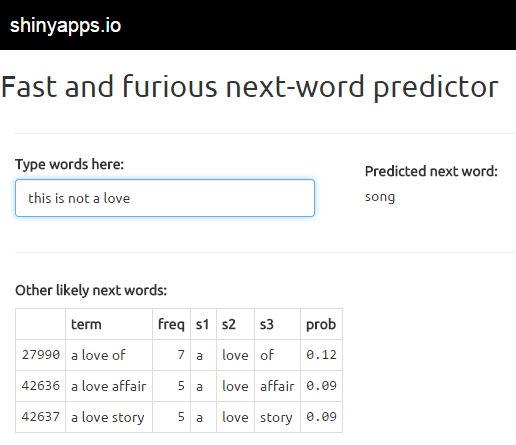

Fast and Furious next-word predictor
========================================================
author: Henry Bowers
date: April 2015

What is Fast and Furious?
========================================================

- Predictor of most likely next word in a word stream
  + no limit to length of word stream
  + other likely words also displayed
- 4-gram language model (English only)
  + three-word lookback with simple back-off approach

Example: 

> This is not a love  |  song

Try it yourself:

https://hmb3.shinyapps.io/F-and-F-WordPredictor/

Using the Fast and Furious Shiny app
========================================================
left:40%

1. Type words into the blue box
2. Pause any time to see next-word prediction on right
3. Table of other likely words appears below your input
4. Continue to add to your word stream or delete your stream and start over

***

How Fast and Furious works (1 of 2)
========================================================

Create n-gram language model:
- vocabulary V = {v1,v2,...,vM}, vi is a word in Corpus C
- unigram model G1 = {wi,P(wi)}  
wi in V, P(wi) = c(vi)
- bigram model G2 = {(wi,wj),P(wi,wj)}  
wi,wj in V, P(wi,wj) = c(wi,wj)/c(wi)
- trigram model G3 = {(wi,wj,wk),P(wi,wj,wk)}  
wi,wj,wk in V, P(wi,wj,wk) = c(wi,wj,wk)/c(wi,wj)
- quadgram model G4 = {(wi,wj,wk,wl),P(wi,wj,wk,wl)}  
wi,wj,wk,wl in V  
P(wi,wj,wk,wl) = c(wi,wj,wk,wl)/c(wi,wj,wk)

How Fast and Furious works (2 of 2)
========================================================

Given:
- Word stream W of length N: (w1,w2,...,wN)
 
Predict most likely next word:  
- IF any (wN-2,wN-1,wN,v) exists in G4,  
THEN wN+1 = v that satisfies max P(wN-2,wN-1,wN,v)  
- ELSE IF any (wN-1,wN,v) exists in G3,  
THEN wN+1 = v that satisfies max P(wN-1,wN,v)  
- ELSE IF any (wN,v) exists in G2,  
THEN wN+1 = v that satisifes max P(wN,v)  
- Else wN+1 cannot be predicted

